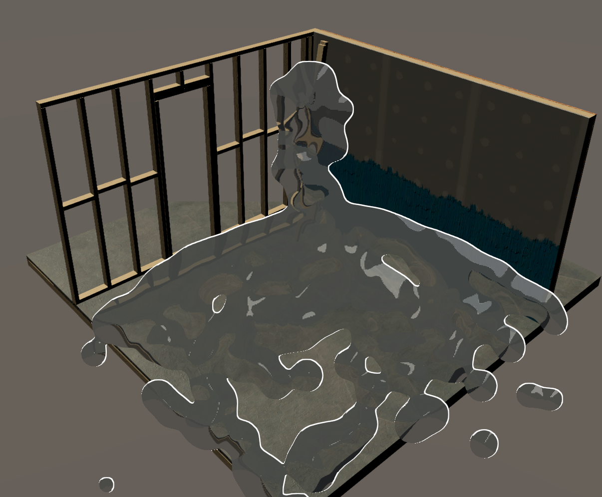

# UnityURP - ScreenSpaceFluid Sample

書籍「[Unityゲーム プログラミング・バイブル 2nd Generation](https://www.amazon.co.jp/dp/4862465072/ref=cm_sw_em_r_mt_dp_XS21ZTK8QR1T8NE5YFXY)」の、No.1 URPのカスタマイズ セクションのサンプルコードです。

- URPに自作のパスを追加して、疑似流体の描画をしています。
